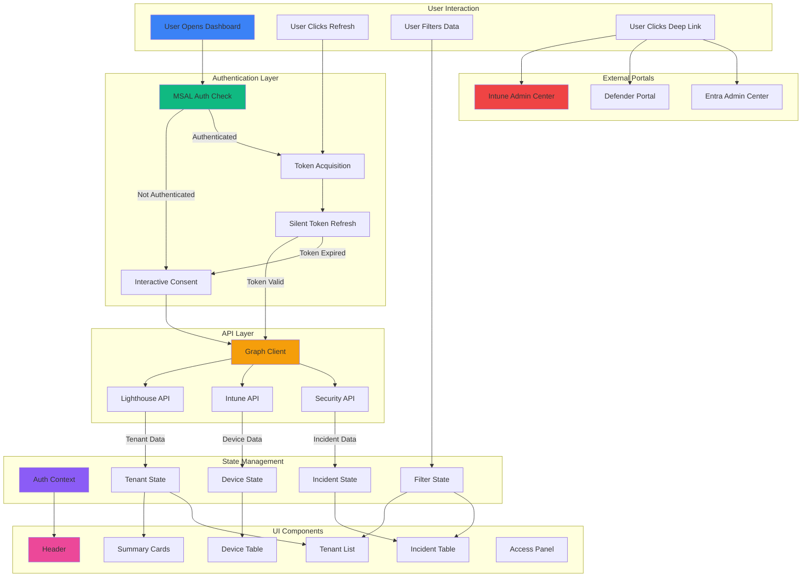

# Component Hierarchy & Data Flow

## Component Tree Structure

```
App.tsx
├── AuthProvider (Context)
│   └── MsalProvider (from @azure/msal-react)
│       └── Layout
│           ├── Header
│           │   ├── AppTitle
│           │   ├── GlobalFilters
│           │   │   ├── TenantFilter (multi-select)
│           │   │   ├── SeverityFilter (chips)
│           │   │   └── TimeRangeSelector (dropdown)
│           │   ├── RefreshIndicator
│           │   │   ├── LastUpdatedTime
│           │   │   └── RefreshButton
│           │   ├── AccessHelpButton (? icon)
│           │   └── UserMenu
│           │       ├── UserInfo (name, tenant)
│           │       └── SignOutButton
│           │
│           ├── SummaryCards (KPI Row)
│           │   ├── TenantCountCard
│           │   ├── DeviceComplianceCard
│           │   ├── IncidentSeverityCard
│           │   └── CriticalTenantsCard
│           │
│           ├── TenantComplianceSection
│           │   ├── SectionHeader
│           │   ├── TenantList (grid)
│           │   │   └── TenantCard[] (multiple)
│           │   │       ├── TenantInfo
│           │   │       ├── ComplianceIndicator
│           │   │       └── DeviceSummary
│           │   └── DeviceDetailsPanel (expanded)
│           │       ├── DeviceTable
│           │       │   └── DeviceRow[]
│           │       │       ├── DeviceInfo
│           │       │       ├── ComplianceState
│           │       │       └── ActionButtons
│           │       │           ├── OpenInIntuneButton
│           │       │           └── OpenUserInEntraButton
│           │       └── TableControls
│           │           ├── ShowAllToggle
│           │           └── SortControls
│           │
│           ├── SecurityIncidentsSection
│           │   ├── SectionHeader
│           │   ├── IncidentFilters
│           │   │   ├── SeverityFilter
│           │   │   ├── StatusFilter
│           │   │   └── TimeRangeFilter
│           │   └── IncidentTable
│           │       └── IncidentRow[]
│           │           ├── SeverityBadge
│           │           ├── IncidentInfo
│           │           ├── TenantInfo
│           │           ├── StatusBadge
│           │           ├── NewIndicator (conditional)
│           │           └── ActionButtons
│           │               └── OpenInDefenderButton
│           │
│           └── AccessPanel (Modal/Sidebar)
│               ├── PermissionsGuide
│               │   ├── RequiredScopes
│               │   └── ScopeExplanations
│               ├── RoleChecker
│               │   ├── CurrentRoles (from myRoles API)
│               │   └── RequiredRoles
│               └── TroubleshootingSteps
│                   ├── CommonIssues
│                   └── ResolutionSteps
```

---

## Data Flow Diagram



---

## State Management Flow

### Authentication State
```typescript
AuthContext {
  isAuthenticated: boolean
  account: AccountInfo | null
  login: () => Promise<void>
  logout: () => void
  acquireToken: (scopes: string[]) => Promise<string>
}
```

**Flow:**
1. App loads → Check MSAL cache
2. If authenticated → Set account in context
3. If not → Show sign-in button
4. User signs in → Acquire tokens → Update context
5. Components use `useAuth()` hook to access state

### Data Fetching State
```typescript
DataState<T> {
  data: T | null
  loading: boolean
  error: Error | null
  lastUpdated: Date | null
  refresh: () => Promise<void>
}
```

**Flow:**
1. Component mounts → Call custom hook (e.g., `useTenants()`)
2. Hook acquires token → Calls API wrapper
3. API returns data → Update state
4. Component renders with data
5. Auto-refresh timer → Repeat from step 2

### Filter State
```typescript
FilterState {
  selectedTenants: string[]
  selectedSeverities: Severity[]
  timeRange: TimeRange
  showOnlyNonCompliant: boolean
}
```

**Flow:**
1. User changes filter → Update filter state
2. Filter state change → Trigger data re-fetch with filters
3. API applies filters → Returns filtered data
4. Components re-render with filtered data

---

## Hook Dependencies

### Custom Hooks Dependency Graph

```
useAuth (MSAL)
    ↓
useMsalToken (acquires tokens)
    ↓
useGraphClient (creates Graph client with token)
    ↓
├── useTenants (fetches tenant data)
│   └── Used by: TenantList, SummaryCards
│
├── useDevices (fetches device data)
│   └── Used by: DeviceTable, SummaryCards
│
├── useIncidents (fetches incident data)
│   └── Used by: IncidentTable, SummaryCards
│
└── useMyRoles (fetches user roles)
    └── Used by: AccessPanel, RoleChecker

useAutoRefresh (timer logic)
    ↓
├── Triggers: useTenants.refresh()
├── Triggers: useDevices.refresh()
└── Triggers: useIncidents.refresh()

useAutoLock (inactivity detection)
    ↓
└── Triggers: useAuth.logout() or shows LockScreen
```

---

## API Call Sequence

### Initial Dashboard Load

```
1. User navigates to dashboard
   ↓
2. App.tsx renders
   ↓
3. AuthProvider checks MSAL cache
   ↓
4. If authenticated:
   ├── Acquire token for ManagedTenants.Read.All
   ├── Call GET /beta/tenantRelationships/managedTenants/tenants
   ├── Store tenant list in state
   ↓
5. Acquire token for DeviceManagementManagedDevices.Read.All
   ├── Call GET /beta/tenantRelationships/managedTenants/managedDeviceCompliance
   ├── Store device compliance in state
   ↓
6. Acquire token for SecurityIncident.Read.All
   ├── Call GET /v1.0/security/incidents?$filter=...
   ├── Store incidents in state
   ↓
7. Render dashboard with all data
   ↓
8. Start auto-refresh timer
```

### Refresh Cycle

```
1. Auto-refresh timer fires (or user clicks refresh)
   ↓
2. For each data source (tenants, devices, incidents):
   ├── Acquire token silently
   ├── If silent fails → Interactive consent
   ├── Call API endpoint
   ├── Compare with previous data
   ├── Mark new/updated items
   ├── Update state
   ↓
3. Components re-render with new data
   ↓
4. Update "Last refreshed" timestamp
   ↓
5. Reset timer for next refresh
```

### Error Handling Flow

```
API Call
   ↓
Try: Silent token acquisition
   ↓
Success? → Make API call
   ↓
   ├── 200 OK → Return data
   ├── 401 Unauthorized → Interactive login → Retry
   ├── 403 Forbidden → Show AccessPanel with guidance
   ├── 429 Rate Limited → Exponential backoff → Retry
   └── 500/503 Server Error → Retry with backoff → Show error if fails
```

---

## Component Communication Patterns

### Parent-Child Props
```typescript
// Parent passes data and callbacks to children
<TenantList 
  tenants={tenants}
  onTenantClick={handleTenantClick}
  selectedTenant={selectedTenant}
/>
```

### Context for Global State
```typescript
// Auth state available to all components
const { isAuthenticated, account } = useAuth();
```

### Custom Hooks for Data
```typescript
// Components fetch their own data
const { tenants, loading, error, refresh } = useTenants();
```

### Event Callbacks
```typescript
// Child notifies parent of events
<DeviceRow 
  device={device}
  onOpenInIntune={() => window.open(deepLink, '_blank')}
/>
```

---

## Rendering Optimization Strategy

### React.memo for Expensive Components
```typescript
export const DeviceRow = React.memo(({ device }) => {
  // Only re-renders if device prop changes
});
```

### useMemo for Computed Values
```typescript
const filteredDevices = useMemo(() => {
  return devices.filter(d => 
    selectedTenants.includes(d.tenantId) &&
    (!showOnlyNonCompliant || d.complianceState !== 'compliant')
  );
}, [devices, selectedTenants, showOnlyNonCompliant]);
```

### useCallback for Event Handlers
```typescript
const handleRefresh = useCallback(async () => {
  await Promise.all([
    refreshTenants(),
    refreshDevices(),
    refreshIncidents()
  ]);
}, [refreshTenants, refreshDevices, refreshIncidents]);
```

### Lazy Loading for Large Lists
```typescript
// If >100 items, use virtualization
import { FixedSizeList } from 'react-window';
```

---

## Security Boundaries

### Token Handling
```
MSAL Library (sessionStorage)
    ↓
AuthProvider (in-memory state)
    ↓
useAuth hook (provides token acquisition)
    ↓
API wrappers (use tokens, never expose)
    ↓
Components (never see tokens)
```

**Rules:**
- ✅ Tokens stored in sessionStorage by MSAL
- ✅ Tokens acquired per-request via hooks
- ✅ Tokens never logged or displayed
- ❌ No manual token storage
- ❌ No tokens in component props
- ❌ No tokens in localStorage

### Permission Boundaries
```
User Signs In
    ↓
Requests Delegated Permissions
    ↓
Admin Grants Consent (one-time)
    ↓
User Gets Access Token with Scopes
    ↓
API Calls Use Token
    ↓
Microsoft Graph Validates Scopes
    ↓
Returns Data (or 403 if insufficient)
```

**Rules:**
- ✅ Only delegated permissions
- ✅ Minimum required scopes
- ✅ Read-only scopes only
- ❌ No application permissions
- ❌ No write scopes
- ❌ No admin-only scopes

---

## Error Boundary Strategy

### Component-Level Error Boundaries
```
App
└── ErrorBoundary (catches all errors)
    └── Layout
        ├── ErrorBoundary (catches header errors)
        │   └── Header
        ├── ErrorBoundary (catches summary errors)
        │   └── SummaryCards
        ├── ErrorBoundary (catches tenant errors)
        │   └── TenantComplianceSection
        └── ErrorBoundary (catches incident errors)
            └── SecurityIncidentsSection
```

**Benefits:**
- Isolated failures (one section fails, others work)
- Specific error messages per section
- Graceful degradation
- User can still access working features

---

## Performance Targets

| Metric | Target | Measurement |
|--------|--------|-------------|
| Initial Load | < 3s | Time to interactive |
| API Response | < 1s | 95th percentile |
| Refresh Cycle | < 2s | All APIs complete |
| UI Render | < 100ms | After data update |
| Memory Usage | < 200MB | After 1 hour running |
| Bundle Size | < 500KB | Gzipped |

---

## Accessibility Features

### Keyboard Navigation
- Tab through all interactive elements
- Enter/Space to activate buttons
- Escape to close modals
- Arrow keys for table navigation

### Screen Reader Support
- ARIA labels on all interactive elements
- ARIA live regions for updates
- Semantic HTML (header, nav, main, section)
- Alt text for icons

### Visual Accessibility
- High contrast dark theme
- Minimum 4.5:1 contrast ratio
- Focus indicators visible
- No color-only information
- Readable from 10+ feet (big screen)

---

This component hierarchy and data flow documentation provides a clear blueprint for implementation, showing how all pieces fit together and communicate.